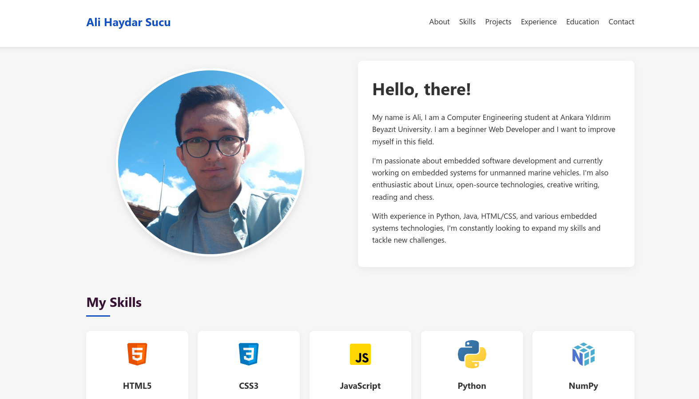

# 🌐 Ali Haydar Sucu - Portfolio Website  

Welcome to my personal portfolio website! This site showcases my background, skills, projects, experience, education, and certifications.  

## 🖥️ Live Website  
You can visit my portfolio here: **[Ali Haydar Sucu Portfolio](https://alihaydarsucu.github.io/portfolio)**  

---

## 📌 Features  
- **About Me** – A brief introduction to who I am.  
- **Skills** – Technologies and tools I have experience with.  
- **Projects** – A selection of my featured projects with links to repositories.  
- **Experience** – Professional and volunteering experiences.  
- **Education** – My academic background.  
- **Certifications** – Relevant courses and credentials.  
- **Contact** – Ways to connect with me via email and social media.  

---

## 🚀 Technologies Used  
- **Frontend**: HTML5, CSS3
- **Version Control**: Git & GitHub  

---

## 📷 Screenshot  
 

---

## 📬 Contact Me  
Feel free to connect with me:  
- 📧 Email: [alihaydarsucu@gmail.com](mailto:alihaydarsucu@gmail.com)  
- 💼 LinkedIn: [Ali Haydar Sucu](https://linkedin.com/in/ali-haydar-sucu)  
- 🐙 GitHub: [alihaydarsucu](https://github.com/alihaydarsucu)  
- 📸 Instagram: [@alihaydarsucu](https://instagram.com/alihaydarsucu)  

---

## 📜 License  
This project is open-source and available under the [MIT License](LICENSE).  

---

⭐ If you like this project, consider giving it a **star** on GitHub!  
